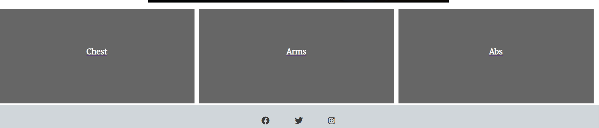
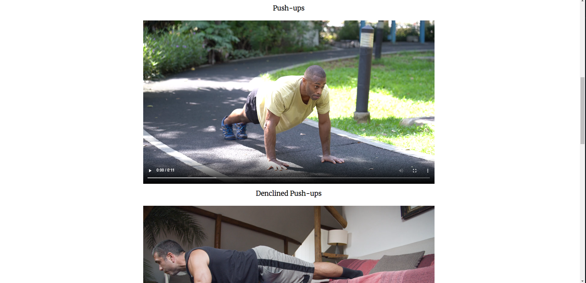
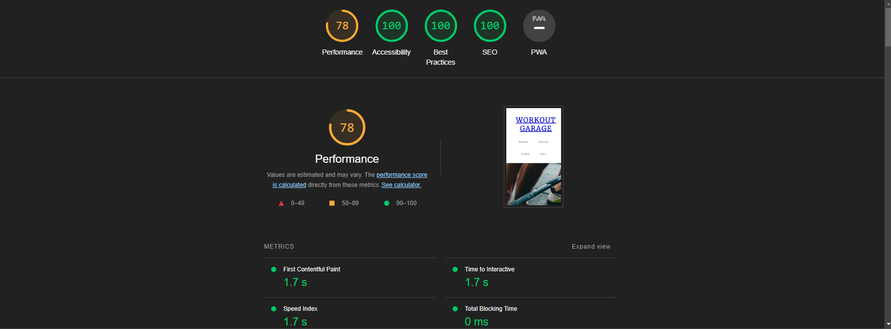

# Project_1_Workout_Site

This site is to help and provide information to beginners who want to learn what the benefits of doing workouts are, and give them easy exercises that target all the major upper body parts. This will help them be healthy and develop upper body strength.

## Features

 -Navigation
  - Centered navigation bar on the beginning of the website that can be hovered over for ease of access.
  
  
  
  - At the bottom of the site, there are also navigation boxes that are easy to see and take the user to the desired page.
  
  
  
  - On the site, you have videos to show you how to do the exercises.
  
  
  
  - At the bottom, you have the social links that will open in a separate tab 
  
  
   
## Testing
  - I confirmed that the website runs in Chrome, Firefox, Safari, and Opera
  
  - I have tested that the website is responsive and adjusts to different screen sizes
  
  - All grammatical errors have been corrected.

 -Bugs
  - Fixed a bug where the site did not load the videos because it couldn't find them: It was because I used a forward slash before specifying the file location. Removing it fixed the issue.
  
  - Fixed an issue where the correct spacing wasn't applied to the paragraph: It was because I forgot to close the tags. Closing them fixed the issue
  
  - Fixed a bug where the CSS wasn't targetting the correct class: It was because there was a space in the class declaration. Putting a dash to separate the words fixed the issue.

 -Validator Testing
  - HTML: No errors were found when put through W3C Validator
  - CSS: No errors were found when put through W3C Validator
  - Accessibility: High score in accessibility given by lighthouse in the dev tools.
  
  
  
  
 -Unfixed bugs
  - The navigation on the bottom of the page, is not centered correctly.
  
## Deployment
 -The site was deployed to GitHub pages
 
## Credit
 -Part of the code was taken from the Love Running Project
 
## Media
 -Images and videos were taken from Pexels.com
